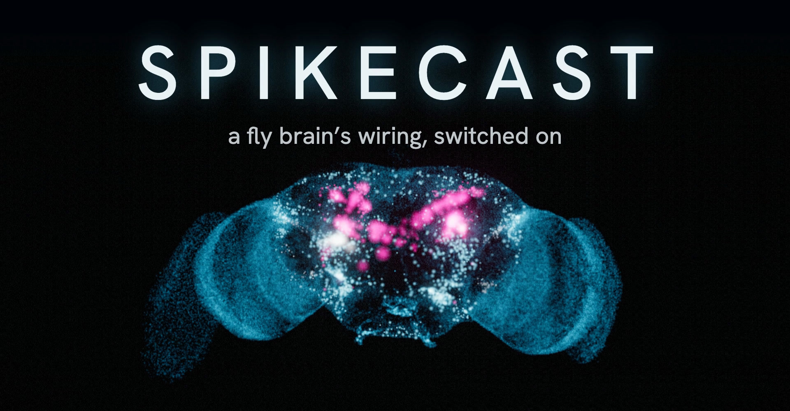
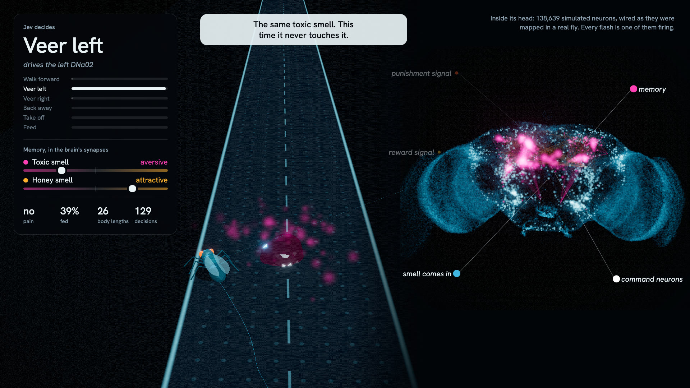
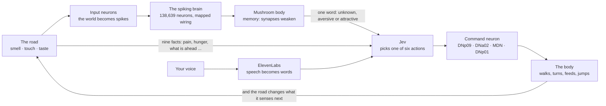
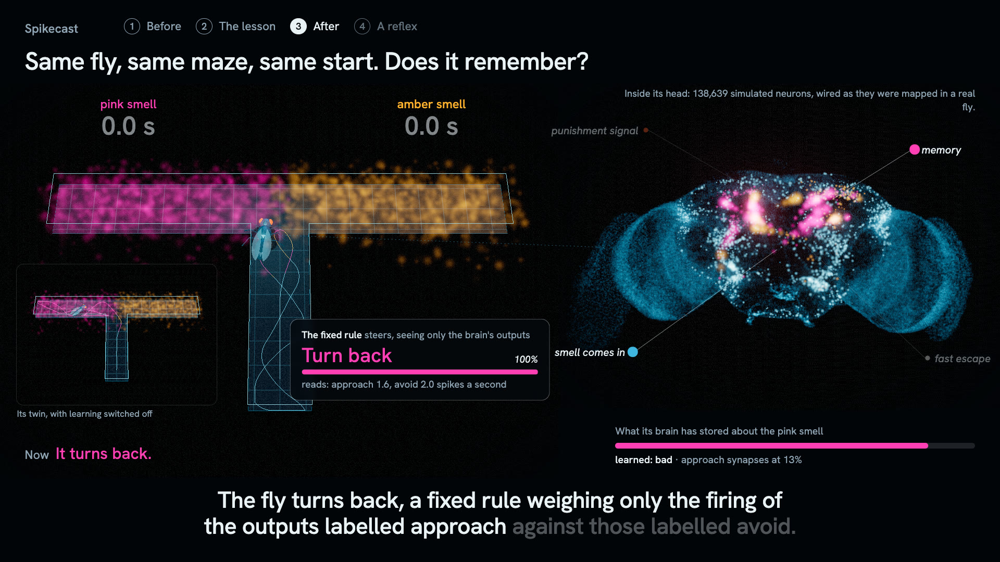
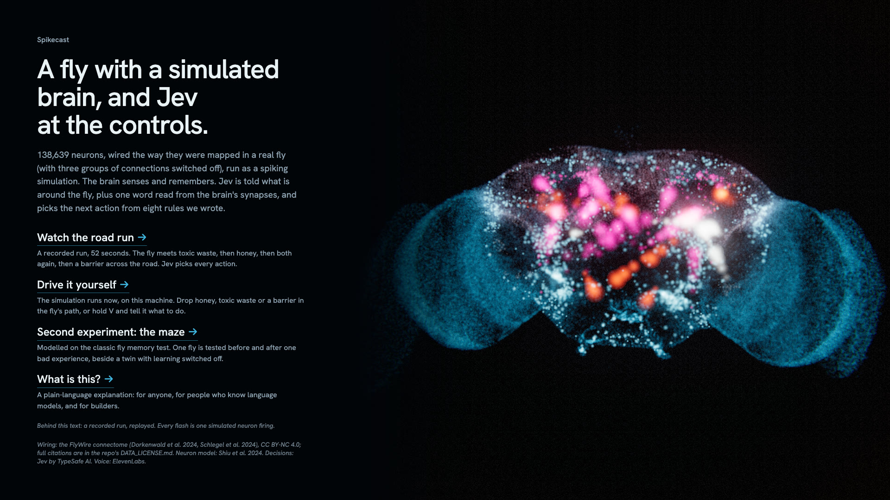

<p align="center">
  <a href="https://spikecast.vercel.app">
    
  </a>
</p>

<h1 align="center">Spikecast</h1>

<p align="center"><b>A fly on a road, with a simulated brain, and Jev at the controls.</b></p>

<p align="center">
  <a href="https://spikecast.vercel.app"></a>
  <a href="docs/EXPLAINER.md"></a>
  <a href="docs/REAL_VS_MODELLED.md"></a>
  <a href="docs/ROAD_REPORT.md"></a>
</p>

<p align="center">
  <a href="LICENSE"></a>
  <a href="https://github.com/padmanabhan-r/Spikecast/commits/main"></a>
  <a href="https://github.com/padmanabhan-r/Spikecast/stargazers"></a>
  
  
  
  
  
</p>

<p align="center">
  <a href="https://typesafe.ai"></a>
  <a href="https://flywire.ai"></a>
  <a href="https://elevenlabs.io"></a>
  
</p>



Spikecast is a Jev project: something built to try Jev out. [Jev](https://typesafe.ai), by TypeSafe AI, is a decision model: it answers a typed question with one of the allowed answers and a probability for each. The experiment here is whether it can make the decisions for a brain.

The brain is a spiking simulation of the fruit fly's wiring diagram: 138,639 neurons and 15 million connections from the FlyWire connectome, with three groups of connections switched off. It is given a body and put on a road. Toxic waste, honey and a barrier are dropped in its path. The simulated brain senses them and remembers: pain weakens the synapses that carry a smell, in the running network. Five times a second of brain time, Jev is told ten facts about the moment and picks the next action. Nine of them come straight from the road and body model. The tenth, what a smell means, is one word read from those synapses.

The first time the fly meets toxic waste it walks into it. In the recording and in four test runs it steered round it the second time. With learning switched off, it walked into it again. Jev and its instructions were the same throughout.

## What is on screen

- **The road**, with the fly on it and whatever has been dropped in its path.
- **Jev decides**: the action Jev just picked, its probability for each of the six, and the neuron that action drives.
- **Memory, in the brain's synapses**: two sliders, one per smell. They move only when synapses in the simulation change.
- **The brain**: every point is one neuron, every flash is that neuron firing in the simulation. The fine lines in the middle are single connections in the mushroom body; when the fly learns, they fade.

## How it works



| Jev picks | What happens in the simulated brain |
|---|---|
| Walk forward | DNp09 is driven |
| Veer left, veer right | the left or right DNa02 is driven, with DNp09 at nine tenths so the fly keeps walking |
| Back away | MDN is driven |
| Take off | DNp01, the giant fiber, is driven; the body leaves the ground only if it is firing |
| Feed | nothing is driven: the fly stands still, and MN9 fires from the sugar through the mapped wiring |

### What Jev is told, and what it is not

Each question carries eight rules written in plain sentences and ten facts about this moment: what the fly is doing, whether it is hungry, sugar under its feet, pain, the curb, what is ahead, which side has more room, whether it is stuck, where the centre line is, and the smell. The smell comes with one word, `unknown`, `aversive` or `attractive`, read from the synapses of the Kenyon cells firing at that moment (`spikecast/motor/driver.py`).

In the driving question Jev is never told what an object is, that a smell once came with pain, or how the fly was trained. If behaviour changes after a lesson, it is because synapses changed. A test checks that question's text for the names of objects and for words about training (`tests/narrate/test_isolation.py`). The separate question that turns a spoken command into an action does name honey, toxic waste and the barrier, because that is what the speaker is asking for.

Jev is following rules it is given, and the same rules exist as code for when Jev cannot be reached. In the recording Jev chose the same action as the coded rules in 249 of 256 decisions. What Jev adds is that the rules are sentences that can be edited by hand, and that a spoken instruction can be mixed in, without writing code. It does not add judgement the rules lack.

## Two experiments

**The road.** The main one, described above. `uv run spikecast record road`

| Run | Touches, first waste | Touches, second waste | Fed on | Touches, barrier | Take-offs | Decisions by Jev |
|---|---|---|---|---|---|---|
| Recording | 1 | 0 | both honeys | 2 | 1 | 256 of 256 |
| Four test runs, seeds 0 to 3 | 1 or 2 | 0 | both honeys | 1 to 3 | 1 | all |
| Control, learning switched off | 4 | 4 | the first honey only | 2 | 1 | 402 of 402 |

The barrier is a row of the same toxic lumps, right across the road. In every run the fly touched it before taking off: the rules send it over only once it is stuck with no way round. A repeated situation reuses Jev's earlier answer within a run, so the recording's 256 decisions came from 82 distinct questions.

Five runs and one control are a demonstration, not a statistic. The full table, the control and what the runs do not show are in the [road report](docs/ROAD_REPORT.md).

**The maze.** Modelled on the classic fly memory test. One fly is tested before and after one bad experience, beside a twin with learning switched off. It uses a fixed rule instead of Jev, so the only difference between the two flies is whether synapses can change. It is one fly, and its wander seed was chosen so that the untrained fly walks into the arm that is later punished. `uv run spikecast record story`



## Talk to it

In the live app you can drop honey, toxic waste or a barrier in the fly's path, or hold `V` and say what you want: "drop some honey", "put a barrier there", "veer left". ElevenLabs turns the speech into words and Jev picks the command from a fixed list. An instruction to the fly is rule six of eight: feeding, pain, being stuck, the curb and a learned aversion all come before it.

## Run it

```bash
./start.sh
```

That installs what is missing, downloads and builds the connectome data on first run (about 135 MB), records the road run if there is none (about three minutes), and opens the app at http://localhost:8000. It needs [uv](https://docs.astral.sh/uv/) (which fetches Python 3.12) and Node with pnpm. It was built and run on an Apple M4 laptop with 16 GB of memory.

Keys go in `.env.local` (copy `.env.example`): `OPENROUTER_API_KEY` for Jev, `ELEVENLABS_API_KEY` for speech in both directions. Without them the app still runs: the coded rules stand in for Jev, and there is no voice.

```bash
uv run spikecast serve            # the app: home, replays, the live brain
uv run spikecast record road      # record the road run, Jev driving
uv run spikecast record story     # record the maze
uv run spikecast narrate road     # voice a recording
uv run pytest                     # tests
```

### The hosted demo

[spikecast.vercel.app](https://spikecast.vercel.app) is the viewer with the recorded runs as files. Nothing is simulated there: the live brain needs this repo, the data and the Python app on a machine.

```bash
uv run python scripts/export_site.py   # writes site/
vercel deploy site --prod
```



## What is real, and what is not

| Real, from published data | Modelled, ours |
|---|---|
| The neurons, their connections and synapse counts (FlyWire, v783) | Which connections are switched off: input onto projection neurons, and the input and output of dopamine neurons |
| Whether a connection excites or inhibits, predicted from its transmitter | The two smells, the pain signal and the reward signal |
| The neuron model and its constants (Shiu et al. 2024), reproduced to r = 0.9998 against the published model in two scenarios | The learning rule and its constants |
| | The body, the road, and how command-neuron spikes become movement |
| | Jev's eight rules, and the labels "approach" and "avoid" on output neurons |

The whole ledger, with caveats, is [docs/REAL_VS_MODELLED.md](docs/REAL_VS_MODELLED.md). What is unfinished is in [docs/plans/STATUS.md](docs/plans/STATUS.md): among other things, neither experiment has statistics yet.

## Where things are

`spikecast/` the Python package: engine, world, sensors, motor, narration, simulation, server · `web/` the viewer, in TypeScript and three.js · `config/` constants, circuits, scenarios, each with its source · `scripts/` data and experiment scripts · `docs/` the explainer, the ledger and the reports · `PLAN.md` the spec.

## Credits and licences

- **Connectome**: FlyWire. Dorkenwald et al. 2024, *Neuronal wiring diagram of an adult brain*, Nature. **Annotations**: Schlegel et al. 2024, Matsliah et al. 2024, Berg et al. 2026 and Tastekin et al. 2026. Full citations are in [DATA_LICENSE.md](DATA_LICENSE.md). The data is CC BY-NC 4.0: it is downloaded at setup and never committed here. The screenshots and the hosted demo derive from it and are shared under the same terms.
- **Neuron model**: Shiu et al. 2024, *A Drosophila computational brain model reveals sensorimotor processing*, Nature.
- **Decisions**: [Jev](https://typesafe.ai), by TypeSafe AI.
- **Voice, in and out**: ElevenLabs. **Maze commentary**: written by Claude, then checked by rule against what the recording shows.
- **Code**: [PolyForm Noncommercial 1.0.0](LICENSE), with attribution. You may run, study and change it for non-commercial purposes, and anything you publish or show that was made with it must credit "Spikecast by Padmanabhan" with a link to this repository. Commercial use needs my permission first.
